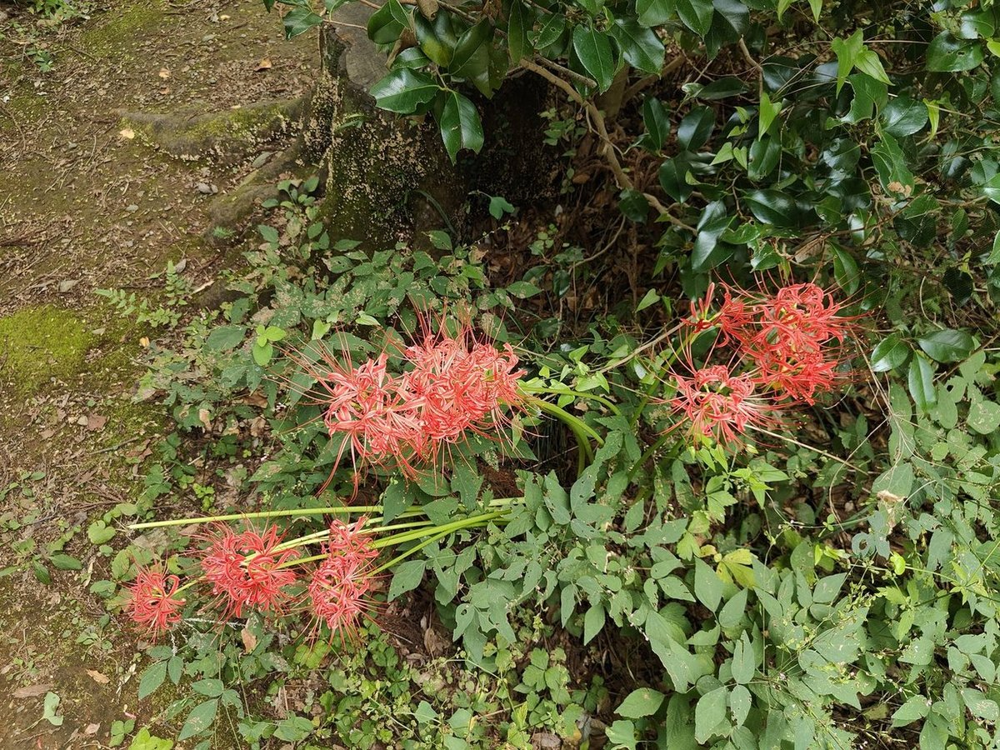
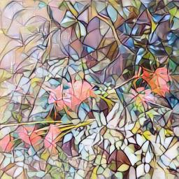
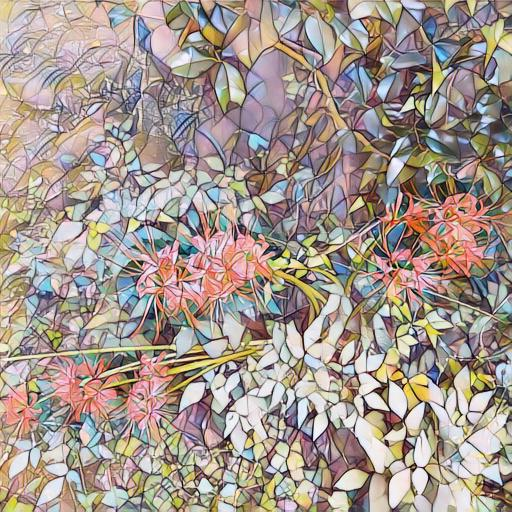
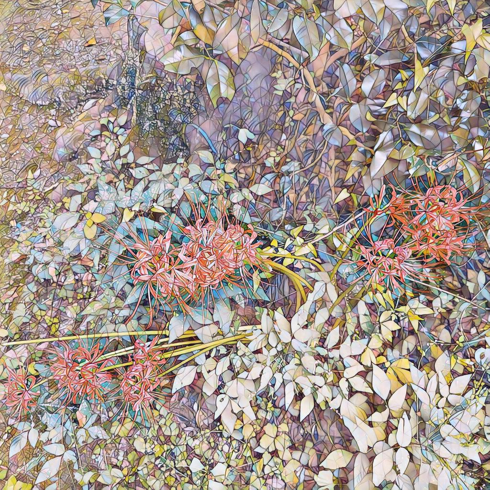

# Real-Time Neural Style Transfer

A PyTorch implementation of [*Perceptual Losses for Real-Time Style Transfer and Super-Resolution*](docs/paper/1603.08155v1.pdf) (Johnson et al., 2016), trained on MS COCO 2017 and deployed on Android via [ExecuTorch](https://pytorch.org/executorch/).

The project covers the full pipeline: training a feed-forward style transfer network in PyTorch, exporting it to multiple mobile backends (XNNPACK, Vulkan) at different◊ precisions, running quantization-aware training to recover INT8 quality, and integrating the final model into an Android app for real-time video stylization.

<p align="center">
  
  
  <br/>
  
  
</p>

<p align="center">
  <em>On-device outputs — top: Vulkan FP32 (640×480), Vulkan FP16 (320×240); bottom: XNNPACK INT8 PTQ (320×240), XNNPACK INT8 QAT-distilled (320×240).</em>
</p>

## Architecture

The system has two networks:

| Network | Role | Trainable |
|---|---|---|
| **Transformer Net** | Feed-forward image transformation (encoder → 5 residual blocks → decoder) | Yes |
| **Loss Net** (VGG-16) | Extracts intermediate features for perceptual loss computation | No (frozen) |

During training, the transformer net learns to minimize a weighted combination of content loss, style loss, and total variation loss. At inference, only the transformer net is needed — a single forward pass stylizes an image.

## Training

Models were trained on **MS COCO 2017** (~118k images) with the **mosaic** style image on Kaggle (T4 x2).

| Parameter | Value |
|---|---|
| Input size | 256 × 256 |
| Batch size | 24 per GPU |
| Epochs | 3 |
| Learning rate | 1e-3 → 1e-6 (cosine) |
| Content weight | 5.0 |
| Style weight | 2e5 |
| Optimizer | Adam |

Two variants were trained — one faithful to the paper (InstanceNorm, reflection padding, nearest upsampling) and one optimized for mobile (BatchNorm, zero padding, bilinear upsampling). The BN variant achieves 98.57% XNNPACK delegation vs. 32.5% for the IN variant, since XNNPACK natively supports BatchNorm as a delegated op while InstanceNorm falls back to CPU.

The model generalizes well beyond its 256×256 training resolution:

| Original | 256 (training res) | 512 | 1024 |
|---|---|---|---|
|  |  |  |  |

Style image: `data/styles/mosaic.jpg`

## Mobile Export (ExecuTorch)

The export pipeline (`src/export_pipeline.py`) is config-driven: each YAML config specifies the checkpoint, backend, precision, and input resolution. The pipeline exports the model to an ExecuTorch `.pte` file, validates it against PyTorch on host via a C++ runner, and optionally benchmarks on a connected Android device.

```bash
# Export
uv run python src/export_pipeline.py export --config configs/export_configs/<config>.yaml

# Validate on host (C++ runner compares .pte output against PyTorch)
uv run python src/export_pipeline.py validate --pte exports/<tag>.pte --ref-input data/test_inference/flower.jpg

# Full pipeline: export → validate → device benchmark
uv run python src/export_pipeline.py full --config configs/export_configs/<config>.yaml --device-id <adb_device>
```

Models were exported across backends and precisions, then benchmarked on device (OnePlus 11, Android 16).

### v1: Finding the right backend + precision

Exported the BN variant to XNNPACK and Vulkan at FP32, FP16, and INT8. QNN (Qualcomm NPU) models were also exported but could not be benchmarked on device — Android restricts direct access to the Qualcomm Hexagon DSP/NPU from third-party apps via driver signing and SELinux policies. The practical alternative would be migrating to LiteRT with the [Qualcomm QNN Accelerator](https://ai.google.dev/edge/litert/android/npu/qualcomm).

**Device benchmarks**:

| Config | Backend | Mean Latency | P95 Latency |
|---|---|---|---|
| BN / FP32 / 640×480 | Vulkan | 603 ms | 608 ms |
| BN / FP16 / 320×240 | Vulkan | 119 ms | 122 ms |
| BN / INT8 / 320×240 | XNNPACK | 56 ms | 69 ms |

FP16 and FP32 on Vulkan produced good quality output. INT8 on XNNPACK was significantly faster but with visibly degraded stylization quality — colors washed out, textures lost detail.

Vulkan's INT8 quantization support in ExecuTorch is limited for conv-heavy models (primarily covers linear ops), so FP16 is the practical best precision for Vulkan on this architecture. XNNPACK runs on CPU, so FP32/FP16 are too slow there (~934ms at 640×480).

**v1 model: Vulkan FP16** — best trade-off between speed and output quality.

### v2: Quantization-Aware Training (QAT with distillation)

INT8 was fast but the post-training quantization destroyed output quality. To fix this, I ran quantization-aware training using distillation:

- **Teacher**: the original FP32 model (frozen)
- **Student**: the same model with fake-quantization nodes inserted via PT2E (`prepare_qat_pt2e`)
- **Loss**: weighted combination of `(1 - cosine_similarity)` and L2 norm between teacher and student outputs
- **Training**: a few epochs on the same MS COCO data, cosine LR schedule
- **Export**: `convert_pt2e` produces real INT8 ops → lowered directly to ExecuTorch `.pte`

```bash
uv run python src/qat.py --config configs/qat_config.yaml
```

The QAT model recovers the quality lost from naive post-training quantization — output is visually on par with the v1 FP16 Vulkan model, but runs on XNNPACK INT8:

<p align="center">
  
  
  <br/>
  <em>Left: PTQ INT8 (washed-out colors, lost texture). Right: QAT-distilled INT8 (quality restored).</em>
</p>


| Config | Backend | Mean Latency | P95 Latency |
|---|---|---|---|
| v1: BN / FP16 / 640×480 | Vulkan | 454 ms | 457 ms |
| v1: BN / INT8 (PTQ) / 320×240 | XNNPACK | 56 ms | 69 ms |
| **v2: BN / INT8 (QAT) / 320×240** | **XNNPACK** | **75 ms** | **143 ms** |

The QAT INT8 model reaches ~12 FPS peak on device with quality matching the FP16 Vulkan output.

**v2 model: XNNPACK INT8 (QAT-distilled)** — faster than v1 with comparable quality.

## Android App

The Android app (`android/`) loads `.pte` models via the ExecuTorch Android runtime and supports:

- **Photo mode**: pick or capture a photo, apply style transfer, view in gallery
- **Video mode**: real-time style transfer on the camera feed using CameraX
- **Benchmark mode**: measure inference latency, memory usage, and FPS on device
- **Model switching**: multiple models bundled as assets, selectable at runtime

Built with Kotlin, CameraX 1.4.1, and ExecuTorch Android SDK 1.1.0 (Vulkan variant).

With the v2 QAT-distilled INT8 model, the app achieves ~10–12 FPS real-time video stylization on the OnePlus 11.

## Project Structure

```
├── src/
│   ├── models/
│   │   ├── trans_net.py             # Feed-forward transformer network
│   │   └── loss_net.py              # VGG-16 feature extractor (frozen)
│   ├── data/
│   │   └── dataset.py               # MS COCO dataset loader
│   ├── utils/
│   │   ├── gram.py                  # Gram matrix computation
│   │   ├── loss.py                  # Content, style, and TV loss functions
│   │   └── image.py                 # Image I/O and transforms
│   ├── train.py                     # Training loop (DDP, W&B, cosine LR, resume)
│   ├── inference.py                 # Single/batch image stylization
│   ├── export_pipeline.py           # ExecuTorch export, host validation, device benchmarking
│   └── qat.py                       # Quantization-aware training (PT2E distillation)
├── android/                         # Kotlin Android app (ExecuTorch runtime)
├── cpp_eval/                        # C++ runner for host-side .pte validation
├── configs/
│   ├── train_config.yaml            # Training hyperparameters
│   ├── export_configs/              # Per-model export configs
│   └── template/                    # Config templates (training, export, QAT)
├── data/                            # Style images, test images, inference results
├── results/                         # Host validation and device benchmark outputs
├── exports/                         # Exported .pte files and JSON sidecars
├── models/                          # Trained checkpoints (gitignored)
├── tests/                           # Unit tests (pytest)
└── docs/                            # Guides and original paper
```

## Setup & Usage

Requires Python 3.12+ and [uv](https://docs.astral.sh/uv/).

```bash
git clone https://github.com/anime-sh16/rtst.git
cd rtst
uv sync --all-extras
```

**Train:**
```bash
# Single GPU
uv run python src/train.py --config configs/train_config.yaml

# Multi-GPU (DDP)
uv run torchrun --nproc_per_node=<N> src/train.py --config configs/train_config.yaml
```

**Inference:**
```bash
uv run python src/inference.py --image path/to/image.jpg
uv run python src/inference.py --image path/to/dir/ --image-size 512 --batch-size 4
```

**Export & benchmark:**
```bash
uv run python src/export_pipeline.py full --config configs/export_configs/<config>.yaml --device-id <adb_device>
```

**QAT:**
```bash
uv run python src/qat.py --config configs/template/qat_config.yaml
```

**Development:**
```bash
uv run ruff check src/ tests/
uv run ruff format src/ tests/
uv run pytest tests/ -v
```

## References

- Johnson, J., Alahi, A., & Fei-Fei, L. (2016). *Perceptual Losses for Real-Time Style Transfer and Super-Resolution.* [arXiv:1603.08155](https://arxiv.org/abs/1603.08155)

## License

MIT
